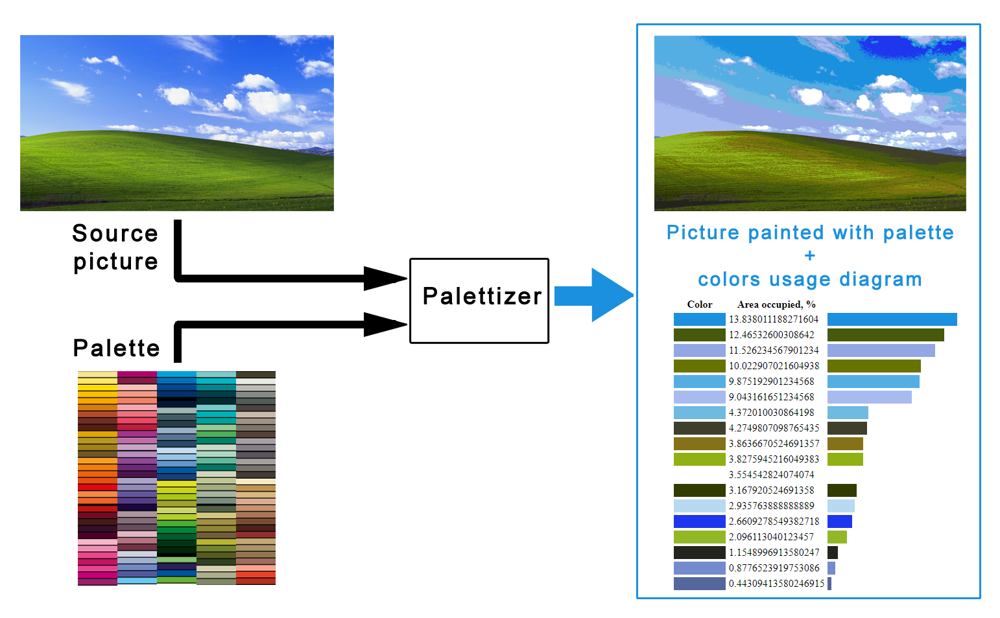

# Palettizer
Palettizer is a tool designed to help artists choose the right colors from a given palette to paint a given picture.
This diagram shows how it works:



You can use it via CLI or Telegram bot.
Telegram bot isn't publicly available yet, but you can run it locally, see [Telegram Bot](#telegram-bot)

## Installation

First, make sure you have this installed on your machine:
* python 3
* pip

Clone the repository

```bash
git clone https://github.com/acdhound/palettizer.git
cd ./palettizer
```

Then create and activate virtual env

```bash
# Unix
pip install virtualenv
virtualenv venv
source ./venv/bin/activate
```

```cmd
REM Windows
pip install virtualenv
virtualenv venv
venv\Scripts\activate.bat
```

Install all required packages:

```shell
pip install .
```

## Usage

### Telegram bot

After project installation is complete you can start Telegram bot locally:

```
python -m palettizerbot <Telgram bot token>
```

To find out more about tokens and creation of a Telegram bot see [Telegram Bot API documentation](https://core.telegram.org/bots#6-botfather). <br>
To get more information on usage of the bot type "/start" into the chat.

### CLI tool

You can use Palettizer CLI by the following command:

```
# Unix
python -m palettizer <input image path> \
    <comma-separated paths to palette files> \
    <output image path> \
    [<max number of colors, 0 is infinite>]
```
```
REM Windows
python -m palettizer <input image path> ^
    <palette files> ^
    <output image path> ^
    [<max number of colors>]
```

Parameters:

* **input image path** is the path to any image file (.jpg, .png etc) you want to convert to a given color palette
* **palette files** are comma-separated paths to JSON files containing color RGB codes and names (example - _palette1.json,palette2.json,palette2.json_).
There are some pre-defined palettes in _palettizer/resources_ folder you can use.
If you'd like to create your own palette files they should have the following structure:
```json
{
  "palette": [
    {"color":"ff0000","name":"Color 1","vendor":"ABC"},
    {"color":"00ff00","name":"Color 2","vendor":"ABC"},
    {"color":"0000ff","name":"Color 3","vendor":"ABC"}
  ]
}
```
* **output image path** is the path to the file to save the converted image
* **max number of colors** is an optional parameter denoting the maximum number of colors to use from the palette.
  If you set it to 0, there will be no limit in colors.

See the example command below:

```shell
# Unix
python -m palettizer palettizer/resources/bliss.jpg \
    palettizer/resources/mtnblack-palette.json,palettizer/resources/mtn94-palette.json \
    output.png \
    30
```
```cmd
REM Windows
python -m palettizer palettizer\resources\bliss.jpg ^
    palettizer\resources\mtnblack-palette.json,palettizer\resources\mtn94-palette.json ^
    output.png ^
    30
```

## For developers

Run tests:

```shell
pip install .[test]
pytest
```
